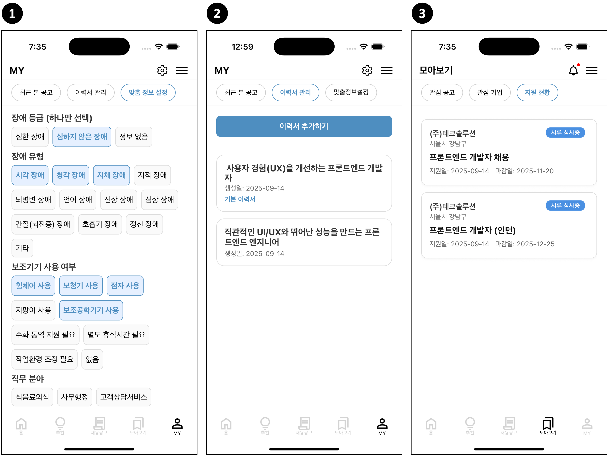
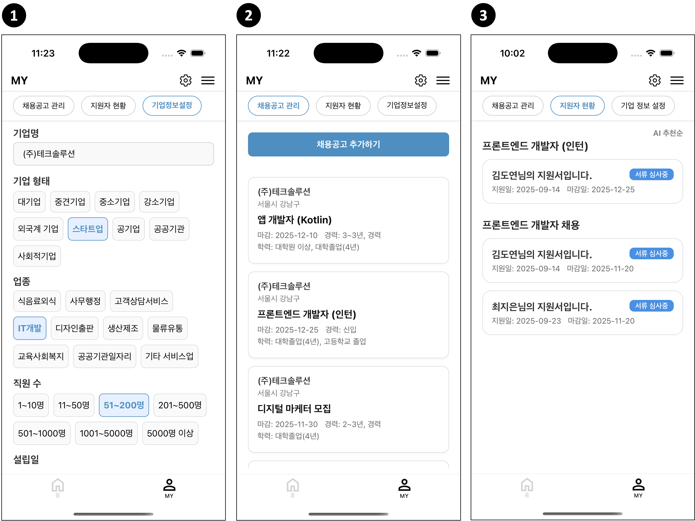
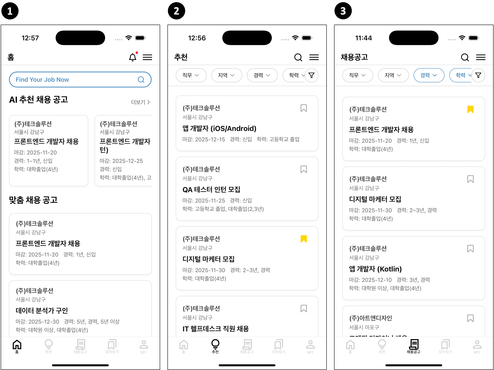
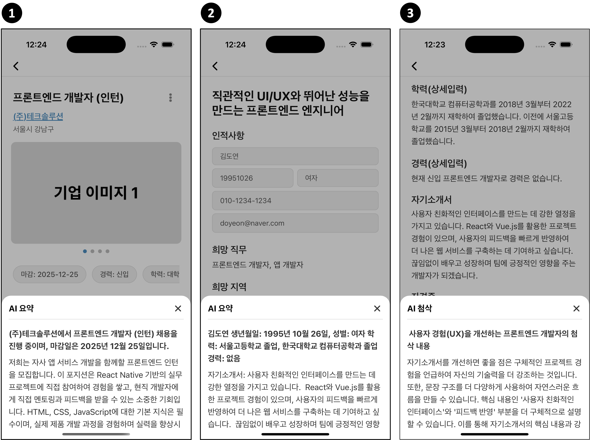
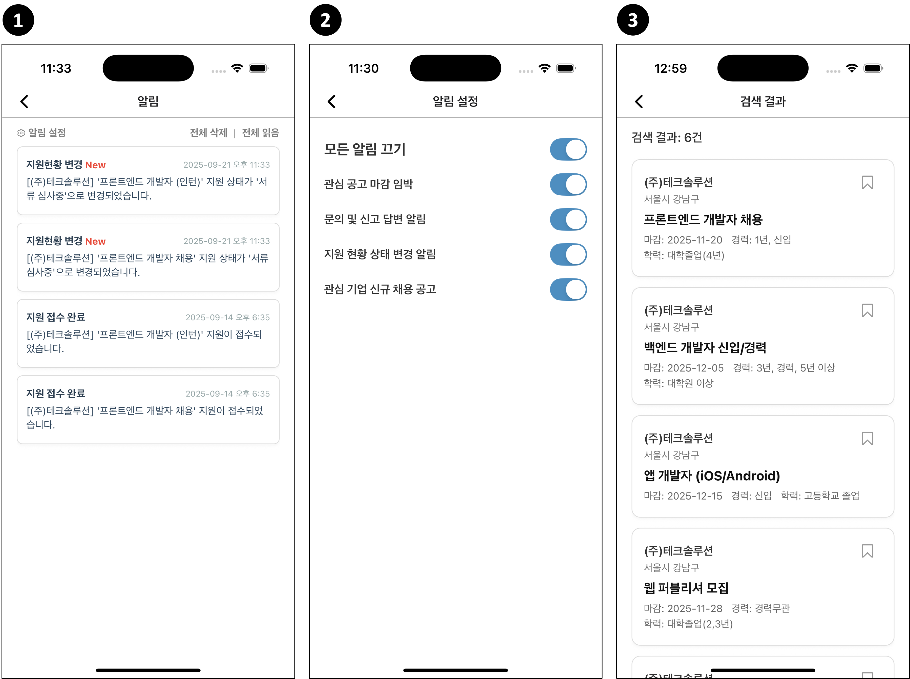

## 작품소개

**AI 기반 맞춤형 장애인 일자리 매칭** 플랫폼입니다.  
개인 설정과 행동 데이터를 분석하여 최적의 채용 공고를 추천하고,  
기업과 구직자를 효율적으로 연결합니다.  
맞춤형 추천 기능을 통해 장애인 구직자들의 취업 경험을 개선하고,  
더 나은 일자리 기회를 제공합니다.

## 기대 효과

- 단순한 구직 플랫폼이 아닌, **장애인 맞춤형 서비스**로 차별화된 가치를 제공합니다.  
- 정보 전달을 넘어 **개인화된 추천과 알람**을 통해 실질적인 취업 기회를 확대합니다.  
- **사용자 경험을 최우선** 가치로 삼고 지속적으로 개선합니다.

## 주요 기능

### 1. 맞춤정보 설정 및 이력서 관리, 행동 데이터 기반 서비스

  

#### 1.1. 개인 맞춤 추천
- 장애 유형 · 희망 직무 · 근무 형태 기반
- 추천 알고리즘으로 최적 공고 제공

#### 1.2. 이력서 관리
- 필수 정보 입력(인적사항·자기소개서·자격증)
- 다중 이력서 생성 및 기본 제출 자동화
- 사용자 맞춤 선택으로 지원 간소화

#### 1.3. 지원·관심 관리
- 지원 현황(지원~합격/불합격) + 관심 데이터 통합
- 진행 상황 관리와 편의성 강화

### 2. 기업정보 설정 및 채용공고 관리, 지원자 현황

  

#### 2.1. 개인 맞춤 추천
- 기업명, 형태, 설립일, 직원 수, 업종, 소개 등
- 신뢰성 있는 정보 제공 및 구직자 이해도 향상

#### 2.2. 이력서 관리
- 공고 생성/수정: 상세 내용, 필요 기술, 장애인 채용 조건
- 체계적 관리로 기업 채용 운영 효율성 강화

#### 2.3. 지원·관심 관리
- 지원~최종 합격/불합격 6단계 상태 관리
- AI 추천순/지원순 정렬 가능, 채용 관리 편의성 향상

### 3. AI 추천 및 맞춤형 추천, 채용공고 목록

  

#### 3.1. 개인 맞춤 추천
- 장애 유형, 보조기구, 직무, 근무 형태 기반
- 행동 데이터 기반 동적 추천 시스템
- 실시간 최적화 공고 제공

#### 3.2. 이력서 관리
- 최근 본 공고, 관심 공고, 지원 공고 등 사용자 행동 데이터 활용
- 텍스트 임베딩(Cohere embed-multilingual-v3.0)으로 벡터화
- 회원별 맞춤형 공고 추천

#### 3.3. 지원·관심 관리
- 전체 채용공고 확인 및 관심 공고 별도 표시
- 직무, 지역, 경력, 학력, 기업, 고용형태 등 상세 필터 적용
- 조건에 맞는 공고 선별 및 효율적 탐색

### 4. AI 요약 및 첨삭

  

#### 4.1. 개인 맞춤 추천
- 제목, 마감일 등 기본 정보 + 상세 채용 내용, 필요 기술, 우대 사항
- 핵심 정보 요약 제공
- 지원자가 빠르게 정보 파악하고 의사결정 가능

#### 4.2. 이력서 관리
- 이름, 학력, 경력 등 기본 정보 + 자기소개서, 자격증 등 상세 정보
- 핵심 정보 요약 제공
- 지원 준비 간소화 및 관리 효율성 강화

#### 4.3.  지원·관심 관리
- 문장 구조, 표현, 내용 구성 분석
- 직무·경험 맞춤 가이드 제공
- 첨삭으로 자기소개서 완성도 향상

### 5. 소켓 알림 침 검색 시스템

  

#### 5.1. 개인 맞춤 추천
- 전체/개별 삭제 가능, 제목·메시지 표시
- 관련 페이지 바로 이동
- 실시간 소켓 통신으로 읽지 않은 알림 구분 및 즉시 반영

#### 5.2. 이력서 관리
- 개인, 기업, 관리자별 맞춤 알림 제공
- 관심 공고, 지원 현황, 문의 답변 등 중요 정보 전달
- 사용자 유형별 최적화 및 관리 효율성 강화

#### 5.3. 지원·관심 관리
- 제목, 회사명, 상세 내용, 장애인 채용 조건 등 검색 가능
- 검색 결과 총 개수 제공
- 원하는 공고를 신속하게 확인 가능

## Tech Stack

#### Frontend (Mobile)
- **Language:** JavaScript
- **Library & Framework:** React Native
- **Mobile:** Expo Go (iOS / Android)
- **State / Storage:** AsyncStorage
- **Env Config:** dotenv

#### Backend
- **Language:** JavaScript (Node.js)
- **Library & Framework:** Express, multer, cors, path, node-cron
- **Database:** MySQL
- **DB Access:** Direct SQL Queries
- **Env Config:** dotenv

## Developer

| 역할                   | 담당자 |
|-----------------------|--------|
| Design & Frontend      | 이도연 |
| Backend (Server & DB)  | 배윤상 |

